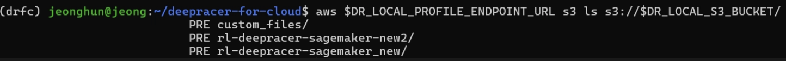
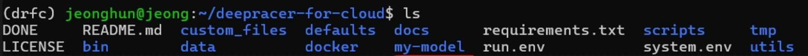
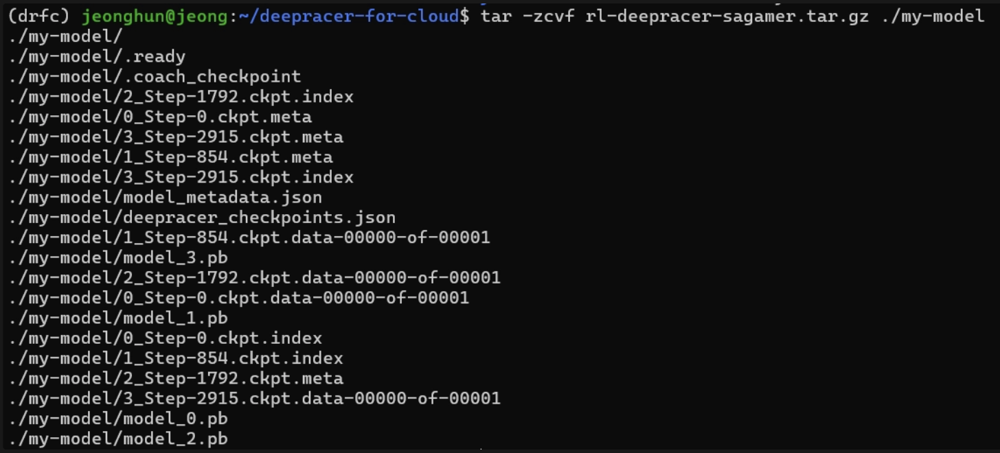
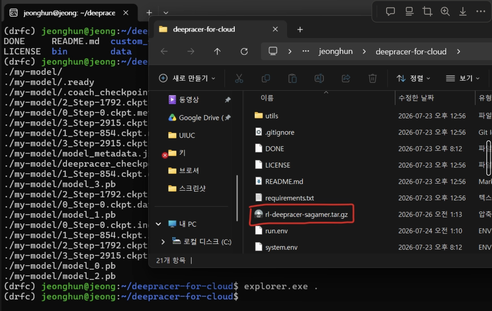
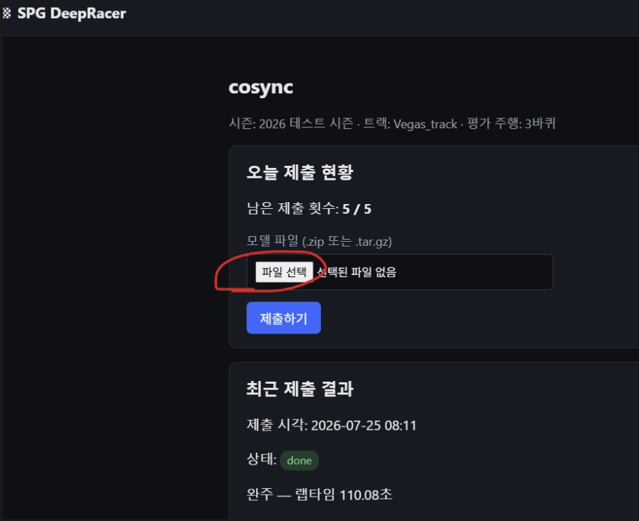

# 1. 제출용 모델 구조

# 순서

1. 제출용 모델 구조 확인
2. 제출할 모델 선택
3. 제출용 모델을 로컬로 복사
4. .tar.gz 파일로 압축
5. Windows 파일 탐색기에서 압축 파일 확인
6. 모델 제출(제출 사이트: https://spg-deepracer.doublejeong.com/leaderboard/6)

제출 파일은:

```text
.tar.gz
```

형태이다.

하지만 모델 prefix 전체를 그대로 압축하면 안 된다.

```text
rl-deepracer-sagemaker/
├── ip/
├── metrics/
├── model/
├── output/
├── training-simtrace/
├── reward_function.py
└── training_params.yaml
```

를 제출하는 것이 아니다.

제출에 필요한 것은:

```text
<모델 prefix>/model/
```

안의 실제 모델 파일들이다.

예:

```text
.ready
.coach_checkpoint

0_Step-0.ckpt.index
0_Step-0.ckpt.meta
0_Step-0.ckpt.data-00000-of-00001

model_metadata.json
deepracer_checkpoints.json

model_0.pb
model_1.pb
model_2.pb
...
```

---

# 2. 제출할 모델 선택

MinIO에 저장된 모델 목록 확인:

```bash
aws $DR_LOCAL_PROFILE_ENDPOINT_URL s3 ls s3://$DR_LOCAL_S3_BUCKET/
```

예:


제출할 모델 prefix를 하나 선택한다.

예:

```text
rl-deepracer-sagemaker-new
```

---

# 3. 제출용 모델을 로컬로 복사

예:

```bash
aws s3 sync \
s3://$DR_LOCAL_S3_BUCKET/제출할모델이름넣기/model/ \
./my-model/ \
$DR_LOCAL_PROFILE_ENDPOINT_URL
```


정상 실행 시 다음과 같은 파일이 다운로드된다.(뭔가 많이 다운로드 됨)

```text
.coach_checkpoint
.ready
0_Step-0.ckpt.index
model_metadata.json
deepracer_checkpoints.json
model_0.pb
...
```

확인:

```bash
ls
```



(my-model 이라는 폴더가 생긴 것을 확인할 수 있음)

---

# 4. tar.gz 압축

DRfC 폴더에서:

```bash
tar -zcvf rl-deepracer-sagemaker.tar.gz ./my-model
```

압축 과정 예:



---

# 5. Windows 파일 탐색기에서 확인

Ubuntu에서:

```bash
explorer.exe .
```

Windows 파일 탐색기가 열린다.

생성된 파일:

```text
rl-deepracer-sagemaker.tar.gz
```

을 확인한다.



---

# 6. 모델 제출

제출 사이트(https://spg-deepracer.doublejeong.com/leaderboard/6)의:

모델제출 → 로그인

파일 선택:

```text
rl-deepracer-sagemaker.tar.gz
```


이후:

```text
제출하기
```

제출 후 평가까지 n분 소요됩니다.
리더보드에서 순위를 확인해보세요!

제출은 마음껏 가능하니 기한까지 많은 학습 및 제출해보시기 바랍니다~