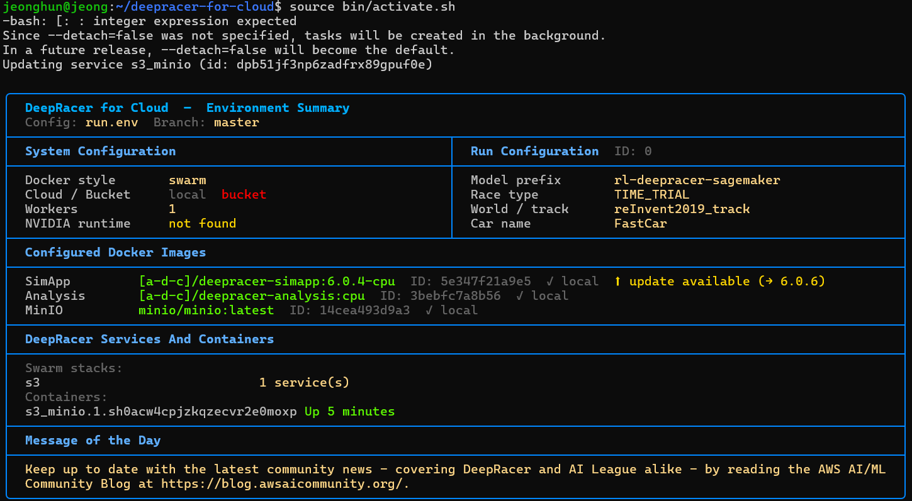
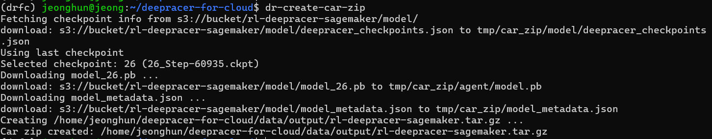
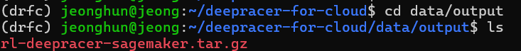
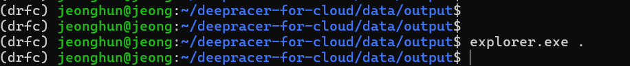
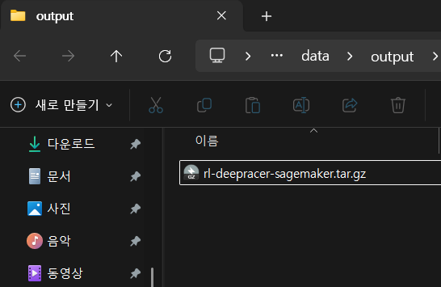

# **5. 오프라인 경주를 위한 Deepracer 모델 다운로드**

**온라인 레이스에서 꽤 괜찮은 모델이 있다면 꼭 이 과정을 진행하여 모델을 다운로드 받으세요!**

안그러면 학습시킨 모델 날아갑니다..

### **주의사항**

이 과정은 학습이 완료된 시점에서 진행이 가능합니다.

그 이유는 모델 탑재에 필요한 파일이 학습이 종료되었을 때 생성되기 때문입니다.

만약 학습이 된 후에 모델 파일을 남겨놓지 않고 코드를 수정하여 다시 학습을 돌렸다면,

**이전 파일은 삭제되기 때문에 다시 학습시키셔야 합니다!!** 이 점 주의하세요!!

이렇게 되면 잘 학습이 되어 기록이 잘 나오더라도 다시 학습을 시켜야하는 불상사가 발생합니다.

시간도 오래걸리고, 잘 만든 모델도 날리고 당연히 비효율적이겠죠?

## 1. DRFC 명령어 입력을 위한 준비

source bin/activate.sh를 실행한 적 있다면 다시 할 필요 없습니다.

deepracer-for-cloud 폴더 안으로 들어갑니다.

```bash
cd deepracer-for-cloud
source bin/activate.sh
```




## 2. dr 명령어 입력

dr-create-car-zip 명령어를 입력하여 오프라인용 모델을 다운 받습니다.

```bash
dr-create-car-zip
```




## 3. .tar.gz 파일 확인

/home/본인경로/deepracer-for-cloud/data/output 경로에 오프라인용 모델이 저장됩니다.

```bash
cd data/output
```



```bash
explorer.exe .
```




## 4. 모델 다운받기

오프라인용 모델 파일을 복사 → 본인 노트북의 원하는 폴더에 붙여넣기 → 입맛에 맞게 파일 이름 수정

추후 오프라인 대회때, 이 모델들을 차량에 탑재하면 자율적으로 주행합니다.


