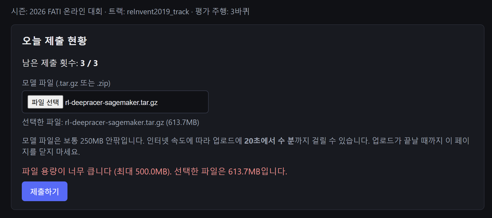
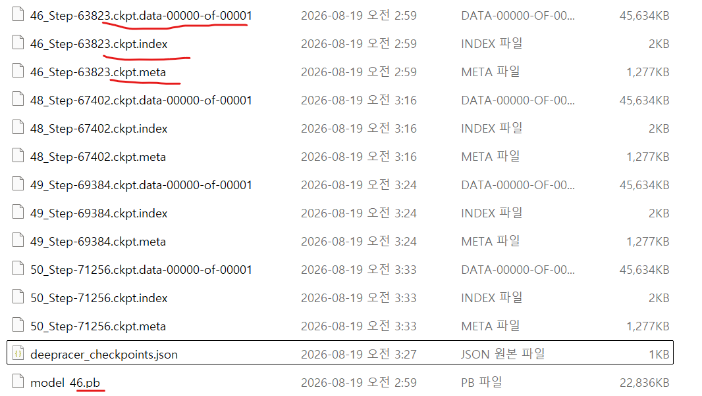
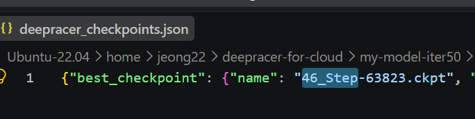

# 에러 슈팅

DeepRacer for Cloud 사용 중 문제가 발생하면 이 문서에서 오류 메시지를 찾아본다.
(만약 귀찮다면 LLM에게 물어보세요~)
(또 에러 해결을 위한 어떤 과정을 수행하기보다
같은 과정을 다시 반복하는 것 또는 잠시 시간을 가지는 것만으로도 해결될 수 있습니다!)

기본적으로 다음 순서부터 확인한다.

# 에러 슈팅 목차

1. `docker: command not found`
2. `docker.service`가 없다고 나오는 경우
3. Docker Swarm 오류 / `This node is not a swarm manager`
4. `dr-*` 명령어가 인식되지 않는 경우
5. `Selected path ... exists. Delete it, or use -w option.`
6. 재부팅 후 학습 서비스가 `0/1`로 남아 있는 경우
7. `docker service ps`에서 `no such service`
8. `s3_minio`가 `0/1`인 경우
9. `docker node ls`가 정상적으로 나오지 않는 경우
10. `dr-update-env`가 인식되지 않는 경우
11. `run.env`를 수정했는데 트랙이 바뀌지 않는 경우
12. 현재 트랙과 기존 모델의 트랙이 다른 것 같은 경우
13. MinIO에 모델이 있는지 확인하고 싶은 경우
14. 로그가 너무 많이 출력되는 경우 (로그 필터링)
15. 노트북을 껐다 켰더니 학습이 멈춘 경우
16. 학습 실패 - RoboMaker/SageMaker 노드 라벨 미지정
17. WSL 연동 예기치 않은 중지 (Symlink 생성 오류)
18. MinIO `InvalidAccessKeyId` 오류
19. `unexpected token 'newline'` / `DR_DOCKER_STYLE=<DOCKER_STYLE>`
20. AWS CLI 실행 시 `X509_V_FLAG_NOTIFY_POLICY`
21. `network "sagemaker-local" is declared as external, but could not be found`
22. `expr: non-integer argument`
23. 모델 업로드할 때 파일이 용량 제한 걸리는 경우

```text
① Docker Desktop이 실행 중인가?

② docker에서 Ubuntu-22.04 WSL Integration이 ON인가?

③ docker info가 정상인가?

④ docker node ls가 Ready / Active / Leader인가?

⑤ dr-* 명령어가 안 먹으면 source bin/activate.sh를 했는가?

⑥ docker service ls에 0/1 서비스가 남아 있지 않은가?

⑦ MinIO가 s3_minio 1/1 상태인가?

⑧ dr-summary의 트랙 및 모델 Prefix가 맞는가?
```

---

# 1. `docker: command not found`
**원인:** Docker Desktop의 WSL Integration(통합) 설정이 아직 적용되지 않았거나 터미널 세션이 갱신되지 않음.
**해결:**
1. Docker Desktop > Settings > Resources > WSL integration에서 Ubuntu 켜기 및 `Apply`
2. PowerShell에서 `wsl --shutdown` 입력하여 WSL 완전 종료
3. Ubuntu 터미널 재시작 후 `docker --version` 확인

## 증상

Ubuntu에서:

```bash
docker --version
```

실행 시:

```text
Command 'docker' not found
```

또는:

```text
The command 'docker' could not be found in this WSL 2 distro.
We recommend to activate the WSL integration in Docker Desktop settings.
```

가 나온다.

---

## 원인

대부분 Docker Desktop과 Ubuntu-22.04의 WSL Integration이 연결되지 않은 경우이다.

Docker Desktop을 사용하는 환경에서는 Ubuntu 내부에 Docker Engine을 별도로 설치하지 않는 것이 좋다.

---

## 해결

Docker Desktop을 실행한다.


```text
Settings
→ Resources
→ WSL Integration
```

다음을 확인한다.

```text
Enable integration with my default WSL distro → ON
Ubuntu-22.04 → ON
```

이후:

```text
Apply & Restart
```

PowerShell:

```powershell
wsl --shutdown
wsl -d Ubuntu-22.04
```

Ubuntu에서 다시 확인:

```bash
docker --version
docker info
```

테스트:

```bash
docker run --rm hello-world
```

다음이 나오면 정상이다.

```text
Hello from Docker!
```

---

# 2. `docker.service`가 없다고 나오는 경우

## 증상

다음 명령을 사용했을 때:

```bash
sudo systemctl start docker
```

또는 비슷한 명령을 실행하면:

```text
Failed to start docker.service:
Unit docker.service not found.
```

라고 나온다.

---

## 원인

Docker Desktop + WSL 방식에서는 Docker daemon이 Ubuntu 내부에서 `docker.service`로 실행되는 것이 아니다.

Docker Engine은 Windows의 Docker Desktop 측에서 실행되고 Ubuntu는 이를 WSL Integration을 통해 사용한다.

따라서 반드시 오류라고 볼 수 없다.

---

## 확인

다음 명령이 정상적으로 실행되는지 확인한다.

```bash
docker info
```

그리고:

```bash
docker service ls
```

정상적으로 Docker 정보와 서비스 목록이 나온다면 Docker 자체는 정상이다.

---

## 결론

Docker Desktop + WSL 환경에서는:

```bash
sudo systemctl start docker
```

를 사용할 필요가 없다.

Docker Desktop을 실행하고 WSL Integration을 확인한다.

---

# 3. Docker Swarm 오류 / `This node is not a swarm manager`

## 증상 1

DRfC 초기화 중 다음과 같은 메시지가 나온다.

```text
could not choose an IP address to advertise since this system has multiple addresses
```

또는:

```text
Error when creating swarm, trying again with advertise address ...
```

---

## 증상 2

다음과 같은 오류가 발생할 수 있다.

```text
Error response from daemon: This node is not a swarm manager.
```

특히 다음 명령을 실행하는 과정에서 나타날 수 있다.

```bash
source bin/activate.sh
```

---

## 원인

DeepRacer for Cloud는 로컬 학습 환경에서 Docker Swarm을 사용한다.

따라서 현재 Docker가 다음 상태 중 하나라면 문제가 발생할 수 있다.

```text
Swarm이 아직 초기화되지 않음
현재 노드가 Manager가 아님
WSL2 네트워크 인터페이스가 여러 개여서 advertise IP를 자동으로 선택하지 못함
```

---

## 먼저 확인

```bash
docker info | grep -i swarm
```

그리고:

```bash
docker node ls
```

정상적인 경우 다음 상태가 확인되어야 한다.

```text
STATUS          Ready
AVAILABILITY    Active
MANAGER STATUS  Leader
```

즉:

```text
Ready
Active
Leader
```

이면 정상이다.

초기화 과정에서 IP 관련 경고가 발생했더라도 최종적으로:

```text
Swarm initialized
```

가 출력되고 `docker node ls`가 정상이라면 별도 조치가 필요 없다.

---

## 해결 방법 1: DRfC 초기화를 다시 수행

가급적 DRfC 자체 초기화 스크립트를 먼저 사용한다.

```bash
cd ~/deepracer-for-cloud
./bin/init.sh -a cpu -c local
```

완료 후:

```bash
docker node ls
```

를 확인한다.

---

## 해결 방법 2: Swarm을 수동으로 초기화

Swarm이 아예 활성화되어 있지 않다면:

```bash
docker swarm init
```

을 사용할 수 있다.

WSL2 환경에서 IP 선택 오류가 발생한다면 현재 사용할 IP를 지정하여 초기화해야 한다.

먼저 IP를 확인한다.

```bash
hostname -I
```

그 후 실제 Docker/WSL 환경에서 접근 가능한 IP를 지정한다.

```bash
docker swarm init --advertise-addr <IP주소>
```

> `127.0.0.1`은 환경에 따라 Docker Swarm 서비스 간 통신에 적합하지 않을 수 있으므로 무조건 고정해서 사용하기보다 실제 WSL/Docker 인터페이스 주소를 확인하는 것을 권장한다.

---

## 기존 Swarm이 꼬인 경우

```bash
docker swarm leave --force
```

이후:

```bash
cd ~/deepracer-for-cloud
./bin/init.sh -a cpu -c local
```

다시 확인:

```bash
docker node ls
```

---

# 4. `dr-*` 명령어가 인식되지 않는 경우

## 증상

예:

```bash
dr-summary
```

실행 시:

```text
dr-summary: command not found
```

또는:

```bash
dr-start-training
```

이 인식되지 않는다.

---

## 원인

DRfC의 `dr-*` 명령어 상당수는 일반 실행 파일이 아니라 `activate.sh`를 통해 현재 shell에 등록되는 함수이다.

새로운 터미널을 열었거나 WSL을 재시작하면 활성화가 풀릴 수 있다.

---

## 해결

```bash
cd ~/deepracer-for-cloud
source bin/activate.sh
```

확인:

```bash
type dr-start-training
```

정상:

```text
dr-start-training is a function
```

또는:

```bash
type dr-summary
```

정상:

```text
dr-summary is a function
```
---

# 5. `Selected path ... exists. Delete it, or use -w option.`

## 증상

학습 시작:

```bash
dr-start-training
```

시 다음과 같은 오류가 나온다.

```text
Selected path s3://bucket/rl-deepracer-sagemaker exists.
Delete it, or use -w option. Exiting.
```

---

## 원인

현재 `run.env`에 지정된 모델 prefix가 MinIO에 이미 존재하기 때문이다.

예:

```bash
DR_LOCAL_S3_MODEL_PREFIX=rl-deepracer-sagemaker
```

인데 MinIO에도:

```text
rl-deepracer-sagemaker/
```

가 존재하는 경우이다.

---

## 해결 방법 1: 기존 Prefix 사용

기존 Prefix를 그대로 허용하려면:

```bash
dr-start-training -w
```

---

## 해결 방법 2: 새로운 Prefix 사용

```bash
nano run.env
```

예:

```bash
DR_LOCAL_S3_MODEL_PREFIX=rl-deepracer-sagemaker-new
```

저장:

```text
Ctrl + O
Enter
Ctrl + X
```

환경 반영:

```bash
dr-update-env
```

확인:

```bash
dr-summary
```

학습:

```bash
dr-start-training
```

---

## 주의

기존 모델이 `reinvent_base`에서 학습되었는데 트랙만 `reInvent2019_track`으로 바꾸고 동일 Prefix를 사용하는 경우 과거 학습 파일과 새 학습 결과가 섞일 수 있다.

모델 관리 및 제출을 명확하게 하고 싶다면 새 Prefix 사용을 권장한다.

---

# 6. 재부팅 후 학습 서비스가 `0/1`로 남아 있는 경우

## 증상

```bash
docker service ls
```

결과:

```text
deepracer-0_rl_coach      0/1
deepracer-0_robomaker     0/1
s3_minio                  1/1
```

---

## 원인

노트북 종료 전에 실행 중이던 Docker Swarm 학습 서비스가 Swarm 설정에 남아 있는 상태일 수 있다.

이 상태를 정상적인 학습 중이라고 보면 안 된다.

---

## 해결

DRfC 활성화:

```bash
cd ~/deepracer-for-cloud
source bin/activate.sh
```

기존 학습 서비스 종료:

```bash
dr-stop-training
```

다시 확인:

```bash
docker service ls
```

정상:

```text
s3_minio   1/1
```

그 후 필요하면 다시 학습한다.

기존 Prefix:

```bash
dr-start-training -w
```

새 Prefix:

```bash
dr-start-training
```

---

# 7. `docker service ps`에서 `no such service`

## 증상

예:

```bash
docker service ps --no-trunc deepracer-0_rl_coach
```

결과:

```text
no such service: deepracer-0_rl_coach
```

---

## 원인

명령을 실행하기 전에 해당 서비스가 이미 제거된 것이다.

예를 들어 `dr-stop-training` 과정에서 서비스가 삭제되었을 수 있다.

---

## 해결

현재 존재하는 서비스를 다시 확인한다.

```bash
docker service ls
```

다음만 남아 있다면:

```text
s3_minio   1/1
```

기존 학습 서비스는 정상적으로 정리된 것이다.

추가 조치가 필요 없다.

---

# 8. `s3_minio`가 `0/1`인 경우

## 증상

```bash
docker service ls
```

결과:

```text
s3_minio   0/1
```

---

## 영향

MinIO가 실행되지 않으면 다음 기능에 문제가 생긴다.

```text
custom_files 업로드
모델 저장
checkpoint 저장
학습 로그 저장
기존 모델 조회
```

따라서 학습을 시작하기 전에 해결해야 한다.

---

## 확인

상세 상태:

```bash
docker service ps s3_minio
```

로그 확인:

```bash
docker service logs s3_minio
```

Docker Desktop이 정상인지 확인:

```bash
docker info
```

Swarm:

```bash
docker node ls
```

---

## 우선 시도

Docker Desktop을 재시작한 뒤:

PowerShell:

```powershell
wsl --shutdown
wsl -d Ubuntu-22.04
```

Ubuntu:

```bash
cd ~/deepracer-for-cloud
source bin/activate.sh
docker service ls
```

그래도 MinIO가 올라오지 않는다면 초기화 상태를 추가로 점검한다.

---

# 9. `docker node ls`가 정상적으로 나오지 않는 경우

## 정상 상태

```bash
docker node ls
```

결과에 다음이 있어야 한다.

```text
Ready
Active
Leader
```

---

## Swarm이 비활성화된 경우

먼저 확인:

```bash
docker info | grep -i swarm
```

Swarm이 활성화되어 있지 않다면 DRfC 초기화를 다시 검토한다.

```bash
cd ~/deepracer-for-cloud
./bin/init.sh -a cpu -c local
```

초기화 후:

```bash
docker node ls
```

확인한다.

---

# 10. `dr-update-env`가 인식되지 않는 경우

## 증상

```bash
dr-update-env
```

실행 시 명령을 찾을 수 없다고 나온다.

---

## 해결

DRfC 환경을 활성화한다.

```bash
cd ~/deepracer-for-cloud
source bin/activate.sh
```

이후:

```bash
dr-update-env
```

확인:

```bash
dr-summary
```

---

# 11. `run.env`를 수정했는데 트랙이 바뀌지 않는 경우

## 증상

```bash
nano run.env
```

에서:

```bash
DR_WORLD_NAME=reInvent2019_track
```

으로 바꿨는데:

```bash
dr-summary
```

에는 이전 트랙이 나온다.

---

## 해결

환경 활성화:

```bash
source bin/activate.sh
```

환경변수 다시 적용:

```bash
dr-update-env
```

다시 확인:

```bash
dr-summary
```

정상:

```text
World / track    reInvent2019_track
```

---

# 12. 현재 트랙과 기존 모델의 트랙이 다른 것 같은 경우

## 문제

`dr-summary`는 현재 `run.env` 기준 설정을 보여준다.

따라서 현재:

```text
World / track    reInvent2019_track
```

이라고 나오더라도 기존 모델이 실제로 `reinvent_base`에서 학습된 모델일 수 있다.

---

## 해결

기존 모델의 `training_params.yaml`을 확인한다.

```bash
aws $DR_LOCAL_PROFILE_ENDPOINT_URL s3 cp \
"s3://$DR_LOCAL_S3_BUCKET/<모델 prefix>/training_params.yaml" \
/tmp/training_params.yaml
```

확인:

```bash
grep -Ei "track|world" /tmp/training_params.yaml
```

제출할 모델의 실제 학습 환경을 확인할 때는 이 방법을 사용한다.

---

# 13. MinIO에 모델이 있는지 확인하고 싶은 경우

모델 목록:

```bash
aws $DR_LOCAL_PROFILE_ENDPOINT_URL s3 ls s3://$DR_LOCAL_S3_BUCKET/
```

예:

```text
PRE custom_files/
PRE rl-deepracer-sagemaker/
```

모델 내부:

```bash
aws $DR_LOCAL_PROFILE_ENDPOINT_URL s3 ls \
s3://$DR_LOCAL_S3_BUCKET/<모델 prefix>/
```

실제 모델:

```bash
aws $DR_LOCAL_PROFILE_ENDPOINT_URL s3 ls \
s3://$DR_LOCAL_S3_BUCKET/<모델 prefix>/model/ \
--recursive
```

다음이 있다면 모델이 저장되어 있는 것이다.

```text
.ready
.coach_checkpoint
*.ckpt.index
*.ckpt.meta
*.ckpt.data-00000-of-00001
model_metadata.json
deepracer_checkpoints.json
model_*.pb
```

---

# 14. 로그가 너무 많이 출력되는 경우(로그 필터링)

정상이다.

SageMaker 로그:

```bash
dr-logs-sagemaker
```

RoboMaker 로그:

```bash
dr-logs-robomaker
```

필요한 로그만 필터링할 수 있다.

예:

```bash
dr-logs-robomaker | grep --line-buffered "SIM_TRACE_LOG"
```

완주에 가까운 로그:

```bash
dr-logs-robomaker | grep --line-buffered "SIM_TRACE_LOG" | \
awk -F',' '$15 >= 99.9 {print}'
```

---

# 15. 노트북을 껐다 켰더니 학습이 멈춘 경우

정상이다.

DRfC 학습은 로컬:

```text
Windows
→ WSL
→ Docker Desktop
→ Docker Swarm
```

환경에서 돌아가기 때문이다.

다음 상태에서는 학습이 계속되지 않는다.

```text
절전
최대 절전
종료
재부팅
```

기존 checkpoint가 MinIO에 남아 있는지 확인한 뒤 다시 학습한다.

전체 복구 과정은:

> `오랜만에다시학습하시나요.md`

를 참고한다.

---

# 16. 학습 실패 - Robomaker/Sagemaker 노드 라벨 미지정**
**증상:** `ERROR: No Swarm Nodes labelled for placement of Robomaker.`
**원인:** 컨테이너를 배치할 Swarm 노드에 역할 라벨(Label)이 지정되지 않음.
**해결:** 현재 노드에 `Robomaker`와 `Sagemaker` 라벨을 추가 (`docker node ls`에서 노드 ID 확인).
```bash
docker node update --label-add Robomaker=true --label-add Sagemaker=true <본인의 노드 ID>
# 예시: docker node update --label-add Robomaker=true --label-add Sagemaker=true wgghdys0m12g6ucf2nb0gym9s
```

---

# 17. WSL 연동 예기치 않은 중지 (Symlink 생성 오류)
**증상:** Ubuntu 접속 시 "WSL integration with distro unexpectedly stopped..." 팝업 및 에러 출력.
**원인:** 이전 설치 잔재 또는 권한 문제로 인해 Ubuntu 내부에 도커 실행 심볼릭 링크를 생성하지 못함.
**해결:**
1. Ubuntu 터미널에서 기존 도커 관련 파일 삭제:
   ```bash
   sudo rm -rf /usr/local/lib/docker
   sudo rm -rf /usr/local/bin/docker*
   ```
2. PowerShell에서 `wsl --shutdown` 실행
3. Docker Desktop 완전히 종료 후 재시작 (Restart Docker Desktop)
4. WSL integration 다시 적용

---

# 18. MinIO `InvalidAccessKeyId` 오류

## 증상

MinIO에 접근하거나 DeepRacer 관련 명령어를 실행할 때 다음과 같은 오류가 발생한다.

```text
InvalidAccessKeyId: The provided access key ID does not exist in the system.
```

---

## 원인

MinIO에 요청할 때 사용한 Access Key가 현재 MinIO 서버에 등록된 Access Key와 일치하지 않는 경우 발생한다.

대표적인 원인은 다음과 같다.

```text
Access Key 오타
기존 Access Key가 삭제되거나 변경됨
MinIO의 인증 정보와 로컬 AWS 인증 정보가 서로 다름
MinIO 서비스가 기존과 다른 인증 정보로 다시 생성됨
```

즉, **MinIO 서버와 DeepRacer for Cloud에서 사용하는 인증 정보가 서로 일치하는지 확인해야 한다.**

---

## 1단계: MinIO 서비스 상태 확인

먼저 MinIO가 정상적으로 실행되고 있는지 확인한다.

```bash
docker service ls
```

정상적인 경우:

```text
s3_minio   1/1
```

`0/1`이라면 먼저 **8. `s3_minio`가 `0/1`인 경우**를 참고한다.

---

## 2단계: MinIO 로그 확인

MinIO 서비스의 정확한 이름을 확인한다.

```bash
docker service ls
```

일반적으로 서비스 이름은:

```text
s3_minio
```

이다.

로그를 확인한다.

```bash
docker service logs s3_minio
```

필요하다면 서비스 ID를 이용할 수도 있다.

```bash
docker service ls
```

에서 `s3_minio`의 ID를 확인한 뒤:

```bash
docker service logs <서비스_ID>
```

를 실행한다.

---

## 3단계: 현재 사용 중인 인증 정보 확인

DeepRacer for Cloud가 사용하는 MinIO/S3 관련 환경 설정을 확인한다.

먼저 DRfC 환경을 활성화한다.

```bash
cd ~/deepracer-for-cloud
source bin/activate.sh
```

환경 설정을 확인한다.

```bash
dr-summary
```

필요하다면 AWS CLI에서 사용하는 인증 정보도 확인한다.

```bash
cat ~/.aws/credentials
```

MinIO에 설정된 Access Key와 여기서 사용하는 Access Key가 서로 일치해야 한다.

> `~/.aws/credentials`에는 Secret Key도 포함될 수 있으므로 화면 공유, 캡처 또는 문서에 그대로 올리지 않도록 주의한다.

---

## 4단계: 인증 정보가 다른 경우

MinIO 서버가 사용하는 인증 정보와 로컬에서 사용하는 인증 정보가 다르다면 둘을 동일하게 맞춰야 한다.

MinIO Console에서 현재 사용자 및 Access Key를 확인하거나 새로운 Access Key를 생성한 뒤, DeepRacer for Cloud에서 사용하는 인증 정보를 동일하게 설정한다.

필요한 경우:

```bash
nano ~/.aws/credentials
```

에서 인증 정보를 수정한다.

수정 후 DRfC 환경을 다시 적용한다.

```bash
cd ~/deepracer-for-cloud
source bin/activate.sh
```

그리고 MinIO 접근을 다시 확인한다.

```bash
aws $DR_LOCAL_PROFILE_ENDPOINT_URL s3 ls s3://$DR_LOCAL_S3_BUCKET/
```

정상적으로 다음과 같이 목록이 출력되면 해결된 것이다.

```text
PRE custom_files/
PRE rl-deepracer-sagemaker/
```

---

## 정리

`InvalidAccessKeyId` 오류가 발생하면 다음 순서로 확인한다.

```text
① s3_minio가 1/1인가?

② docker service logs s3_minio에 인증 관련 오류가 있는가?

③ MinIO의 Access Key가 무엇인지 확인했는가?

④ DeepRacer for Cloud/AWS CLI가 같은 Access Key를 사용하고 있는가?

⑤ 인증 정보를 수정한 뒤 다시 MinIO에 접근해 보았는가?
```

---

# 19. `unexpected token 'newline'` / `DR_DOCKER_STYLE=<DOCKER_STYLE>`

## 증상

다음 명령을 실행할 때:

```bash
source bin/activate.sh
```

또는:

```bash
dr-start-training
```

다음과 같은 오류가 발생한다.

```text
bash: eval: line 14: syntax error near unexpected token `newline'
```

또는:

```text
-bash: syntax error near unexpected token `newline'
```

설정 내용을 확인하면 다음과 같은 값이 남아 있을 수 있다.

```bash
export DR_DOCKER_STYLE=<DOCKER_STYLE>
```

또는:

```bash
DR_DOCKER_STYLE=<DOCKER_STYLE>
```

---

## 원인

`system.env`에 실제 값 대신 기본 템플릿 플레이스홀더가 그대로 남아 있기 때문이다.

예:

```bash
DR_DOCKER_STYLE=<DOCKER_STYLE>
```

Bash에서 `<`와 `>`는 단순한 문자열 기호가 아니라 입출력 리다이렉션과 관련된 문법으로 사용되기 때문에 오류가 발생한다.

또한 DRfC 초기화 과정에서 `system.env`가 다시 생성되거나 템플릿 기준으로 변경될 수 있으므로 **수정 순서가 중요하다.**

---

## 해결

가능하면 다음 순서로 진행한다.

```text
init.sh 실행
↓
system.env 확인 및 수정
↓
activate.sh 실행
```

DRfC 폴더로 이동한다.

```bash
cd ~/deepracer-for-cloud
```

초기화가 필요한 상황이라면 먼저:

```bash
./bin/init.sh -a cpu -c local
```

을 실행한다.

> 기존 문서에서 특별히 `sudo` 실행을 요구하는 경우가 아니라면 우선 일반 사용자 권한으로 실행한다. Docker Desktop + WSL 환경에서는 Docker 명령 자체에 `sudo`가 필요하지 않은 구성이 일반적이다.

그 다음:

```bash
nano system.env
```

다음 항목을 찾는다.

```bash
DR_DOCKER_STYLE=<DOCKER_STYLE>
```

수정:

```bash
DR_DOCKER_STYLE=swarm
```

저장:

```text
Ctrl + O
Enter
Ctrl + X
```

환경 적용:

```bash
source bin/activate.sh
```

필요하면:

```bash
dr-update-env
```

확인:

```bash
dr-summary
```

---

## 다른 플레이스홀더도 확인

`system.env`에 `<...>` 형태의 템플릿 값이 더 남아 있는지 확인한다.

```bash
grep -nE '<[^>]+>' system.env
```

`run.env`도 같이 확인하는 것이 좋다.

```bash
grep -nE '<[^>]+>' run.env
```

출력이 있다면 해당 환경 변수에 실제 값을 넣어야 한다.

---

# 20. AWS CLI 실행 시 `X509_V_FLAG_NOTIFY_POLICY`

## 증상

예를 들어:

```bash
aws configure --profile minio
```

를 실행했을 때 다음과 비슷한 Python 오류가 발생한다.

```text
AttributeError: module 'lib' has no attribute 'X509_V_FLAG_NOTIFY_POLICY'
```

---

## 원인

Ubuntu에 설치된 AWS CLI v1이 시스템 Python 패키지를 사용하는 과정에서 `pyOpenSSL`, `cryptography` 등 관련 패키지 버전이 충돌하면 발생할 수 있다.

즉 DeepRacer 자체의 문제가 아니라 **AWS CLI v1과 시스템 Python 환경 사이의 의존성 충돌**에 가깝다.

---

## 권장 해결 방법

AWS CLI v1을 패키지 의존성과 함께 억지로 맞추기보다 시스템 Python과 독립적으로 배포되는 AWS CLI v2를 사용하는 것이 깔끔하다.

기존 apt 기반 AWS CLI가 설치되어 있다면:

```bash
sudo apt remove awscli -y
sudo apt autoremove -y
```

CPU 아키텍처 확인:

```bash
uname -m
```

일반적인 x86_64 WSL 환경이라면:

```text
x86_64
```

가 출력된다.

AWS CLI v2 다운로드:

```bash
curl "https://awscli.amazonaws.com/awscli-exe-linux-x86_64.zip" \
-o "awscliv2.zip"
```

압축 해제 도구 설치:

```bash
sudo apt install unzip -y
```

압축 해제:

```bash
unzip awscliv2.zip
```

설치:

```bash
sudo ./aws/install
```

확인:

```bash
aws --version
```

정상적으로 AWS CLI v2가 표시되는지 확인한다.

예:

```text
aws-cli/2.x.x ...
```

그 후:

```bash
aws configure --profile minio
```

를 다시 실행한다.

---

## 주의

다음 명령의 다운로드 파일은 `x86_64`용이다.

```text
awscli-exe-linux-x86_64.zip
```

따라서:

```bash
uname -m
```

결과가 `aarch64` 등 다른 아키텍처라면 해당 아키텍처용 AWS CLI 설치 파일을 사용해야 한다.

---

# 21. `network "sagemaker-local" is declared as external, but could not be found`

## 증상

DRfC 환경을 활성화하거나 관련 Docker Stack을 실행할 때 다음과 같은 오류가 발생한다.

```text
network "sagemaker-local" is declared as external, but could not be found
```

---

## 원인

DeepRacer for Cloud가 사용할 Docker Overlay Network인:

```text
sagemaker-local
```

이 생성되지 않은 상태이다.

초기화 과정이 중간에 실패했거나 Docker Swarm 설정이 정상적으로 완료되지 않은 경우 발생할 수 있다.

---

## 먼저 확인

Swarm 상태:

```bash
docker node ls
```

정상적으로:

```text
Ready
Active
Leader
```

인지 확인한다.

현재 네트워크 목록:

```bash
docker network ls
```

여기에:

```text
sagemaker-local
```

이 있는지 확인한다.

---

## 해결

네트워크가 없다면 생성한다.

```bash
docker network create \
-d overlay \
--attachable \
sagemaker-local
```

다시 확인:

```bash
docker network ls
```

---

## RoboMaker / SageMaker 라벨도 함께 확인

노드 확인:

```bash
docker node ls
```

현재 노드 ID를 변수에 저장한다.

```bash
SWARM_NODE=$(docker node ls -q | head -n 1)
```

확인:

```bash
echo "$SWARM_NODE"
```

필수 라벨 추가:

```bash
docker node update \
--label-add Sagemaker=true \
--label-add Robomaker=true \
"$SWARM_NODE"
```

확인:

```bash
docker node inspect "$SWARM_NODE" \
--format '{{json .Spec.Labels}}'
```

정상적으로 다음 두 라벨이 포함되어 있어야 한다.

```text
Sagemaker
Robomaker
```

환경을 다시 활성화한다.

```bash
cd ~/deepracer-for-cloud
source bin/activate.sh
```

> 이 항목은 **16. 학습 실패 - RoboMaker/SageMaker 노드 라벨 미지정**과 증상이 일부 연결된다.  
> 16번은 라벨 자체가 없는 경우이고, 21번은 우선 `sagemaker-local` Docker Network 자체가 없는 경우이다.

---

# 22. `expr: non-integer argument`

## 증상

학습을 시작할 때:

```bash
dr-start-training
```

다음 오류가 여러 번 출력된다.

```text
expr: non-integer argument
```

학습이 정상적으로 시작되지 않거나 이후:

```text
Selected path ... exists. Delete it, or use -w option.
```

같은 메시지가 함께 나타날 수도 있다.

---

## 원인

`run.env`에서 숫자가 들어가야 하는 환경 변수에 템플릿 값이나 빈 값이 들어가 있는 경우 발생할 수 있다.

예를 들어:

```bash
DR_TRAIN_MINUTES=<MINUTES>
```

처럼 되어 있다면 내부 스크립트가 `expr`을 이용해 산술 연산을 수행할 수 없다.

초기화 후 `run.env`가 템플릿 상태로 돌아간 경우에는 특히 주의한다.

---

## 먼저 확인

```bash
cd ~/deepracer-for-cloud
```

플레이스홀더 검색:

```bash
grep -nE '<[^>]+>' run.env
```

시간 관련 설정 확인:

```bash
grep -nE 'DR_TRAIN_MINUTES|DR_EVAL_MINUTES' run.env
```

---

## 해결

```bash
nano run.env
```

학습 시간을 정수로 지정한다.

예:

```bash
DR_TRAIN_MINUTES=60
DR_EVAL_MINUTES=15
```

숫자에는 따옴표나 단위를 붙이지 않는다.

잘못된 예:

```bash
DR_TRAIN_MINUTES=60min
DR_TRAIN_MINUTES=<60>
DR_TRAIN_MINUTES="60 minutes"
```

정상:

```bash
DR_TRAIN_MINUTES=60
```

---

## 모델 Prefix도 같이 확인

```bash
grep 'DR_LOCAL_S3_MODEL_PREFIX' run.env
```

예:

```bash
DR_LOCAL_S3_MODEL_PREFIX=rl-deepracer-sagemaker
```

이미 해당 Prefix가 MinIO에 존재한다면:

```text
Selected path ... exists.
```

오류가 날 수 있다.

이 경우에는 **5. `Selected path ... exists`** 항목을 참고한다.

새로운 모델 Prefix를 사용하거나:

```bash
dr-start-training -w
```

옵션을 목적에 맞게 사용한다.

---

## `$DR_RUN_ID`를 Prefix에 넣는 경우

모델별로 Prefix를 자동 분리하고 싶다면 환경에서 `DR_RUN_ID`가 실제로 설정되고 사용하는 DRfC 버전과 호환되는지 먼저 확인한 뒤 다음과 같은 방식을 사용할 수 있다.

```bash
DR_LOCAL_S3_MODEL_PREFIX=rl-deepracer-sagemaker-$DR_RUN_ID
```

확인:

```bash
echo "$DR_RUN_ID"
```

값이 비어 있다면 이 방식을 바로 사용하지 말고 명시적으로 서로 다른 Prefix를 설정하는 것이 안전하다.

예:

```bash
DR_LOCAL_S3_MODEL_PREFIX=rl-deepracer-sagemaker-run1
```

---

## 환경 다시 적용

```bash
source bin/activate.sh
dr-update-env
```

확인:

```bash
dr-summary
```

다시 학습:

```bash
dr-start-training
```

---

## 정상적으로 시작되는 경우

다음과 비슷한 메시지가 출력된다.

```text
Creating service deepracer-0_rl_coach
Creating service deepracer-0_robomaker
```

이후 많은 Docker/환경 변수 관련 로그가 출력될 수 있다.

Redis가 시작되면서 다음과 비슷한 로그가 출력되는 것도 정상적인 초기화 과정일 수 있다.

```text
Redis is starting
```

따라서 해당 문구 자체를 에러로 판단하지 않는다.

---

# 뭔가 완전히 꼬인 것 같을 때

> ⚠️ 이 절은 일반적인 에러 해결 방법이 아니다.
>
> 아래 명령은 기존 환경과 데이터를 대량으로 삭제한다.
>
> 특히:
>
> ```text
> wsl --unregister
> docker system prune -a --volumes
> rm -rf ~/.aws
> ```
>
> 는 실행 전에 반드시 삭제 범위를 확인한다.

---

# A. Ubuntu 자체를 완전히 초기화

가장 강력한 초기화 방법이다.

Ubuntu 안에 다른 프로젝트나 중요한 파일이 없다면 사용할 수 있다.

## 1단계: 현재 배포판 확인

Windows PowerShell:

```powershell
wsl -l -v
```

예:

```text
NAME            STATE     VERSION
Ubuntu-22.04    Running   2
```

---

## 2단계: 필요한 경우 백업

```powershell
wsl --export Ubuntu-22.04 D:\ubuntu-backup.tar
```

이 명령으로 현재 WSL 배포판을 tar 파일 형태로 백업할 수 있다.

---

## 3단계: WSL 종료

```powershell
wsl --shutdown
```

---

## 4단계: Ubuntu 삭제

```powershell
wsl --unregister Ubuntu-22.04
```

> ⚠️ 이 명령을 실행하면 해당 Ubuntu 배포판 내부의 파일과 설치 프로그램 및 설정이 삭제된다.

예를 들어 Ubuntu 안에 저장되어 있었다면 다음도 함께 삭제될 수 있다.

```text
deepracer-for-cloud 저장소
Ubuntu 내부 패키지
AWS CLI 설정
~/.aws
Python 환경
apt로 설치한 프로그램
system.env
run.env
각종 shell 환경 설정
Ubuntu 파일 시스템 내부 데이터
```

Docker Desktop 데이터의 저장 위치는 구성에 따라 WSL 배포판과 별도로 관리될 수 있으므로, `wsl --unregister Ubuntu-22.04`만으로 Docker Desktop 전체 이미지·볼륨이 반드시 모두 삭제된다고 단정하지 않는다.

Docker 데이터까지 제거하려면 아래 Docker 초기화 절을 별도로 확인한다.

---

## 5단계: Ubuntu 다시 설치

설치 가능한 배포판:

```powershell
wsl --list --online
```

Ubuntu 22.04 설치:

```powershell
wsl --install -d Ubuntu-22.04
```

이후 환경 설정 문서의 처음부터 다시 진행한다.

---

# B. Ubuntu는 남기고 DRfC 환경만 정리

Ubuntu 안에서 다른 프로젝트도 사용한다면 이 방법을 사용한다.

## 1단계: Docker 리소스 확인

먼저 현재 컨테이너를 확인한다.

```bash
docker ps -a
```

이미지:

```bash
docker image ls
```

볼륨:

```bash
docker volume ls
```

다른 프로젝트 Docker 리소스가 있다면 아래 전체 삭제 명령을 실행하지 않는다.

---

## 2단계: Docker 전체 데이터 정리

정말 Docker 리소스를 모두 지워도 되는 경우에만:

```bash
docker ps -aq | xargs -r docker rm -f
```

그리고:

```bash
docker system prune -a --volumes -f
```

> ⚠️ DeepRacer뿐 아니라 현재 같은 Docker Engine을 사용하는 다른 프로젝트의 사용하지 않는 이미지, 컨테이너, 네트워크 및 볼륨도 삭제될 수 있다.

---

## 3단계: Docker Swarm 해제

현재 Swarm 상태 확인:

```bash
docker info | grep -i swarm
```

필요하다면:

```bash
docker swarm leave --force
```

---

## 4단계: DRfC 저장소 삭제

```bash
cd ~
rm -rf ~/deepracer-for-cloud
```

다른 위치에 설치했는지 확인하려면:

```bash
find ~ -maxdepth 3 \
-type d \
-name "deepracer-for-cloud" \
2>/dev/null
```

출력된 경로를 확인한 뒤 필요한 저장소만 삭제한다.

---

## 5단계: AWS CLI 설정 확인

```bash
aws configure list-profiles
```

예:

```text
default
minio
```

AWS 설정 전체가 DeepRacer 전용인 것이 확실하다면:

```bash
rm -rf ~/.aws
```

로 제거할 수 있다.

> ⚠️ 다른 AWS 프로젝트에서 사용하는 Profile이 있다면 `~/.aws` 전체를 삭제하면 안 된다.

그 경우 다음 파일을 직접 열어:

```bash
nano ~/.aws/credentials
```

또는:

```bash
nano ~/.aws/config
```

DeepRacer/MinIO 관련 Profile만 제거한다.

---

## 6단계: Shell 설정 확인

다음 명령으로 DRfC 관련 설정이 남아 있는지 확인한다.

```bash
grep -nEi 'deepracer|DR_|activate\.sh' \
~/.profile \
~/.bashrc \
~/.bash_profile \
2>/dev/null
```

예를 들어:

```text
source ~/deepracer-for-cloud/bin/activate.sh
export DRFC_WSL_IP=...
export DR_LOCAL_S3_ENDPOINT_URL=...
```

등이 남아 있다면 해당 shell 설정 파일을 열어 필요한 항목만 제거한다.

---

# 전체 초기화 권장 순서

환경이 꼬였다고 해서 바로 Ubuntu 전체를 삭제하지 않는다.

다음 순서대로 올라가는 것을 권장한다.

```text
1단계
source bin/activate.sh 다시 실행
        ↓
2단계
Docker Desktop 재시작 + wsl --shutdown
        ↓
3단계
Docker Swarm / MinIO / DRfC 상태 점검
        ↓
4단계
DRfC 저장소만 다시 구성
        ↓
5단계
Docker 리소스 전체 초기화
        ↓
6단계
마지막 수단으로 Ubuntu 배포판 unregister 후 재설치
```

가능하면 **`wsl --unregister`는 최후의 수단으로만 사용한다.**

---

### 23. 모델 업로드할때 파일 용량 제한에 걸려서 안 된다면?


-> 제출하려는 모델 파일에서 초반 스텝의 파일들을 지우고 다시 압축하여 올려보세요

- 하는 방법 : 
1. 압축 하기 전의  모델 파일 이름을 확인합니다 (기본 : my-model폴더) 

2. 해당 폴더가 있는 곳으로 이동합니다 (예시 : deepracer-for-cloud 폴더 등)

3. 파일 탐색기를 엽니다. 아래 명령어를 입력합니다.
```bash
explorer.exe .
```

4. window의 파일탐색기에서 진행합니다.
열린 폴더의 파일중에 deepracer_checkpoints.json이라는 파일을 열어서 가장 성능 좋은 모델을 확인합니다 
(예시 : "best_checkpoint": {"name": "46_Step-63823.ckpt")



5-1. best step 이전의 step들을 지워줍니다. (예시 : 0~45번째 step 파일들, model_숫자.pb 파일들) 

5-2. 주의사항 : .coach_chekpoint 파일, .ready 파일등의 기본 파일들은 삭제하면 안됩니다! 

6. best checkpoint로 뽑힌 스텝이 46이라면 46에 해당하는 파일이 4개 존재하는지 확인합니다 (.ckpt.data-00000-of-00001 파일, .ckpt.index 파일, .ckpt.meta 파일, model_46.pb 파일)

7. 다시 ubuntu 환경으로 돌아옵니다. 

tar -zcvf rl-deepracer-sagemaker.tar.gz ./my-model 
명령어를 입력하여 압축 후 제출합니다.