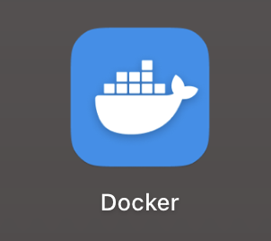

# 에러 슈팅

DeepRacer for Cloud 사용 중 문제가 발생하면 이 문서에서 오류 메시지를 찾아본다.
(만약 귀찮다면 LLM에게 물어보세요~)
(또 에러 해결을 위한 어떤 과정을 수행하기보다
같은 과정을 다시 반복하는 것 또는 잠시 시간을 가지는 것만으로도 해결될 수 있습니다!)

기본적으로 다음 순서부터 확인한다.

# 에러 슈팅 목차

1. `docker: command not found`
2. `docker.service`가 없다고 나오는 경우
3. Docker Swarm IP 오류
4. `dr-*` 명령어가 인식되지 않는 경우
5. `Selected path ... exists. Delete it, or use -w option.`
6. 재부팅 후 학습 서비스가 `0/1`로 남아 있는 경우
7. `docker service ps`에서 `no such service`
8. `s3_minio`가 `0/1`인 경우
9. `docker node ls`가 정상적으로 나오지 않는 경우
10. `dr-update-env`가 인식되지 않는 경우
11. `run.env`를 수정했는데 트랙이 바뀌지 않는 경우
12. 현재 트랙과 기존 모델의 트랙이 다른 것 같은 경우
13. MinIO에 모델이 있는지 확인하고 싶은 경우
14. 로그가 너무 많이 출력되는 경우 (로그 필터링)
15. 노트북을 껐다 켰더니 학습이 멈춘 경우
16. 학습 실패 - RoboMaker/SageMaker 노드 라벨 미지정
17. WSL 연동 예기치 않은 중지 (Symlink 생성 오류)

```text
① Docker Desktop이 실행 중인가?

② docker에서 Ubuntu-22.04 WSL Integration이 ON인가?

③ docker info가 정상인가?

④ docker node ls가 Ready / Active / Leader인가?

⑤ dr-* 명령어가 안 먹으면 source bin/activate.sh를 했는가?

⑥ docker service ls에 0/1 서비스가 남아 있지 않은가?

⑦ MinIO가 s3_minio 1/1 상태인가?

⑧ dr-summary의 트랙 및 모델 Prefix가 맞는가?
```

---

# 1. `docker: command not found`
**원인:** Docker Desktop의 WSL Integration(통합) 설정이 아직 적용되지 않았거나 터미널 세션이 갱신되지 않음.
**해결:**
1. Docker Desktop > Settings > Resources > WSL integration에서 Ubuntu 켜기 및 `Apply`
2. PowerShell에서 `wsl --shutdown` 입력하여 WSL 완전 종료
3. Ubuntu 터미널 재시작 후 `docker --version` 확인

## 증상

Ubuntu에서:

```bash
docker --version
```

실행 시:

```text
Command 'docker' not found
```

또는:

```text
The command 'docker' could not be found in this WSL 2 distro.
We recommend to activate the WSL integration in Docker Desktop settings.
```

가 나온다.

---

## 원인

대부분 Docker Desktop과 Ubuntu-22.04의 WSL Integration이 연결되지 않은 경우이다.

Docker Desktop을 사용하는 환경에서는 Ubuntu 내부에 Docker Engine을 별도로 설치하지 않는 것이 좋다.

---

## 해결

Docker Desktop을 실행한다.


```text
Settings
→ Resources
→ WSL Integration
```

다음을 확인한다.

```text
Enable integration with my default WSL distro → ON
Ubuntu-22.04 → ON
```

이후:

```text
Apply & Restart
```

PowerShell:

```powershell
wsl --shutdown
wsl -d Ubuntu-22.04
```

Ubuntu에서 다시 확인:

```bash
docker --version
docker info
```

테스트:

```bash
docker run --rm hello-world
```

다음이 나오면 정상이다.

```text
Hello from Docker!
```

---

# 2. `docker.service`가 없다고 나오는 경우

## 증상

다음 명령을 사용했을 때:

```bash
sudo systemctl start docker
```

또는 비슷한 명령을 실행하면:

```text
Failed to start docker.service:
Unit docker.service not found.
```

라고 나온다.

---

## 원인

Docker Desktop + WSL 방식에서는 Docker daemon이 Ubuntu 내부에서 `docker.service`로 실행되는 것이 아니다.

Docker Engine은 Windows의 Docker Desktop 측에서 실행되고 Ubuntu는 이를 WSL Integration을 통해 사용한다.

따라서 반드시 오류라고 볼 수 없다.

---

## 확인

다음 명령이 정상적으로 실행되는지 확인한다.

```bash
docker info
```

그리고:

```bash
docker service ls
```

정상적으로 Docker 정보와 서비스 목록이 나온다면 Docker 자체는 정상이다.

---

## 결론

Docker Desktop + WSL 환경에서는:

```bash
sudo systemctl start docker
```

를 사용할 필요가 없다.

Docker Desktop을 실행하고 WSL Integration을 확인한다.

---

# 3. Docker Swarm IP 오류

## 증상

DRfC 초기화 중:

```text
could not choose an IP address to advertise since this system has multiple addresses
```

가 나온다.

이후 다음과 비슷한 메시지가 나올 수 있다.

```text
Error when creating swarm, trying again with advertise address ...
```

---

## 먼저 확인

이후 최종적으로:

```text
Swarm initialized
```

가 출력되었다면 자동 재시도가 성공했을 가능성이 높다.

확인:

```bash
docker node ls
```

다음 상태라면 정상이다.

```text
STATUS          Ready
AVAILABILITY    Active
MANAGER STATUS  Leader
```

즉:

```text
Ready
Active
Leader
```

이면 별도 조치가 필요 없다.

---

## 계속 실패하는 경우

현재 Swarm 상태를 확인한다.

```bash
docker info | grep -i swarm
```

필요하다면 기존 Swarm을 나간 후 DRfC 초기화를 다시 수행할 수 있다.

```bash
docker swarm leave --force
```

이후 DRfC 폴더에서:

```bash
cd ~/deepracer-for-cloud
./bin/init.sh -a cpu -c local
```

다시:

```bash
docker node ls
```

를 확인한다.

---

# 4. `dr-*` 명령어가 인식되지 않는 경우

## 증상

예:

```bash
dr-summary
```

실행 시:

```text
dr-summary: command not found
```

또는:

```bash
dr-start-training
```

이 인식되지 않는다.

---

## 원인

DRfC의 `dr-*` 명령어 상당수는 일반 실행 파일이 아니라 `activate.sh`를 통해 현재 shell에 등록되는 함수이다.

새로운 터미널을 열었거나 WSL을 재시작하면 활성화가 풀릴 수 있다.

---

## 해결

```bash
cd ~/deepracer-for-cloud
source bin/activate.sh
```

확인:

```bash
type dr-start-training
```

정상:

```text
dr-start-training is a function
```

또는:

```bash
type dr-summary
```

정상:

```text
dr-summary is a function
```
---

# 5. `Selected path ... exists. Delete it, or use -w option.`

## 증상

학습 시작:

```bash
dr-start-training
```

시 다음과 같은 오류가 나온다.

```text
Selected path s3://bucket/rl-deepracer-sagemaker exists.
Delete it, or use -w option. Exiting.
```

---

## 원인

현재 `run.env`에 지정된 모델 prefix가 MinIO에 이미 존재하기 때문이다.

예:

```bash
DR_LOCAL_S3_MODEL_PREFIX=rl-deepracer-sagemaker
```

인데 MinIO에도:

```text
rl-deepracer-sagemaker/
```

가 존재하는 경우이다.

---

## 해결 방법 1: 기존 Prefix 사용

기존 Prefix를 그대로 허용하려면:

```bash
dr-start-training -w
```

---

## 해결 방법 2: 새로운 Prefix 사용

```bash
nano run.env
```

예:

```bash
DR_LOCAL_S3_MODEL_PREFIX=rl-deepracer-sagemaker-new
```

저장:

```text
Ctrl + O
Enter
Ctrl + X
```

환경 반영:

```bash
dr-update-env
```

확인:

```bash
dr-summary
```

학습:

```bash
dr-start-training
```

---

## 주의

기존 모델이 `reinvent_base`에서 학습되었는데 트랙만 `reInvent2019_track`으로 바꾸고 동일 Prefix를 사용하는 경우 과거 학습 파일과 새 학습 결과가 섞일 수 있다.

모델 관리 및 제출을 명확하게 하고 싶다면 새 Prefix 사용을 권장한다.

---

# 6. 재부팅 후 학습 서비스가 `0/1`로 남아 있는 경우

## 증상

```bash
docker service ls
```

결과:

```text
deepracer-0_rl_coach      0/1
deepracer-0_robomaker     0/1
s3_minio                  1/1
```

---

## 원인

노트북 종료 전에 실행 중이던 Docker Swarm 학습 서비스가 Swarm 설정에 남아 있는 상태일 수 있다.

이 상태를 정상적인 학습 중이라고 보면 안 된다.

---

## 해결

DRfC 활성화:

```bash
cd ~/deepracer-for-cloud
source bin/activate.sh
```

기존 학습 서비스 종료:

```bash
dr-stop-training
```

다시 확인:

```bash
docker service ls
```

정상:

```text
s3_minio   1/1
```

그 후 필요하면 다시 학습한다.

기존 Prefix:

```bash
dr-start-training -w
```

새 Prefix:

```bash
dr-start-training
```

---

# 7. `docker service ps`에서 `no such service`

## 증상

예:

```bash
docker service ps --no-trunc deepracer-0_rl_coach
```

결과:

```text
no such service: deepracer-0_rl_coach
```

---

## 원인

명령을 실행하기 전에 해당 서비스가 이미 제거된 것이다.

예를 들어 `dr-stop-training` 과정에서 서비스가 삭제되었을 수 있다.

---

## 해결

현재 존재하는 서비스를 다시 확인한다.

```bash
docker service ls
```

다음만 남아 있다면:

```text
s3_minio   1/1
```

기존 학습 서비스는 정상적으로 정리된 것이다.

추가 조치가 필요 없다.

---

# 8. `s3_minio`가 `0/1`인 경우

## 증상

```bash
docker service ls
```

결과:

```text
s3_minio   0/1
```

---

## 영향

MinIO가 실행되지 않으면 다음 기능에 문제가 생긴다.

```text
custom_files 업로드
모델 저장
checkpoint 저장
학습 로그 저장
기존 모델 조회
```

따라서 학습을 시작하기 전에 해결해야 한다.

---

## 확인

상세 상태:

```bash
docker service ps s3_minio
```

로그 확인:

```bash
docker service logs s3_minio
```

Docker Desktop이 정상인지 확인:

```bash
docker info
```

Swarm:

```bash
docker node ls
```

---

## 우선 시도

Docker Desktop을 재시작한 뒤:

PowerShell:

```powershell
wsl --shutdown
wsl -d Ubuntu-22.04
```

Ubuntu:

```bash
cd ~/deepracer-for-cloud
source bin/activate.sh
docker service ls
```

그래도 MinIO가 올라오지 않는다면 초기화 상태를 추가로 점검한다.

---

# 9. `docker node ls`가 정상적으로 나오지 않는 경우

## 정상 상태

```bash
docker node ls
```

결과에 다음이 있어야 한다.

```text
Ready
Active
Leader
```

---

## Swarm이 비활성화된 경우

먼저 확인:

```bash
docker info | grep -i swarm
```

Swarm이 활성화되어 있지 않다면 DRfC 초기화를 다시 검토한다.

```bash
cd ~/deepracer-for-cloud
./bin/init.sh -a cpu -c local
```

초기화 후:

```bash
docker node ls
```

확인한다.

---

# 10. `dr-update-env`가 인식되지 않는 경우

## 증상

```bash
dr-update-env
```

실행 시 명령을 찾을 수 없다고 나온다.

---

## 해결

DRfC 환경을 활성화한다.

```bash
cd ~/deepracer-for-cloud
source bin/activate.sh
```

이후:

```bash
dr-update-env
```

확인:

```bash
dr-summary
```

---

# 11. `run.env`를 수정했는데 트랙이 바뀌지 않는 경우

## 증상

```bash
nano run.env
```

에서:

```bash
DR_WORLD_NAME=reInvent2019_track
```

으로 바꿨는데:

```bash
dr-summary
```

에는 이전 트랙이 나온다.

---

## 해결

환경 활성화:

```bash
source bin/activate.sh
```

환경변수 다시 적용:

```bash
dr-update-env
```

다시 확인:

```bash
dr-summary
```

정상:

```text
World / track    reInvent2019_track
```

---

# 12. 현재 트랙과 기존 모델의 트랙이 다른 것 같은 경우

## 문제

`dr-summary`는 현재 `run.env` 기준 설정을 보여준다.

따라서 현재:

```text
World / track    reInvent2019_track
```

이라고 나오더라도 기존 모델이 실제로 `reinvent_base`에서 학습된 모델일 수 있다.

---

## 해결

기존 모델의 `training_params.yaml`을 확인한다.

```bash
aws $DR_LOCAL_PROFILE_ENDPOINT_URL s3 cp \
"s3://$DR_LOCAL_S3_BUCKET/<모델 prefix>/training_params.yaml" \
/tmp/training_params.yaml
```

확인:

```bash
grep -Ei "track|world" /tmp/training_params.yaml
```

제출할 모델의 실제 학습 환경을 확인할 때는 이 방법을 사용한다.

---

# 13. MinIO에 모델이 있는지 확인하고 싶은 경우

모델 목록:

```bash
aws $DR_LOCAL_PROFILE_ENDPOINT_URL s3 ls s3://$DR_LOCAL_S3_BUCKET/
```

예:

```text
PRE custom_files/
PRE rl-deepracer-sagemaker/
```

모델 내부:

```bash
aws $DR_LOCAL_PROFILE_ENDPOINT_URL s3 ls \
s3://$DR_LOCAL_S3_BUCKET/<모델 prefix>/
```

실제 모델:

```bash
aws $DR_LOCAL_PROFILE_ENDPOINT_URL s3 ls \
s3://$DR_LOCAL_S3_BUCKET/<모델 prefix>/model/ \
--recursive
```

다음이 있다면 모델이 저장되어 있는 것이다.

```text
.ready
.coach_checkpoint
*.ckpt.index
*.ckpt.meta
*.ckpt.data-00000-of-00001
model_metadata.json
deepracer_checkpoints.json
model_*.pb
```

---

# 14. 로그가 너무 많이 출력되는 경우(로그 필터링)

정상이다.

SageMaker 로그:

```bash
dr-logs-sagemaker
```

RoboMaker 로그:

```bash
dr-logs-robomaker
```

필요한 로그만 필터링할 수 있다.

예:

```bash
dr-logs-robomaker | grep --line-buffered "SIM_TRACE_LOG"
```

완주에 가까운 로그:

```bash
dr-logs-robomaker | grep --line-buffered "SIM_TRACE_LOG" | \
awk -F',' '$15 >= 99.9 {print}'
```

---

# 15. 노트북을 껐다 켰더니 학습이 멈춘 경우

정상이다.

DRfC 학습은 로컬:

```text
Windows
→ WSL
→ Docker Desktop
→ Docker Swarm
```

환경에서 돌아가기 때문이다.

다음 상태에서는 학습이 계속되지 않는다.

```text
절전
최대 절전
종료
재부팅
```

기존 checkpoint가 MinIO에 남아 있는지 확인한 뒤 다시 학습한다.

전체 복구 과정은:

> `오랜만에다시학습하시나요.md`

를 참고한다.

---

# 16. 학습 실패 - Robomaker/Sagemaker 노드 라벨 미지정**
**증상:** `ERROR: No Swarm Nodes labelled for placement of Robomaker.`
**원인:** 컨테이너를 배치할 Swarm 노드에 역할 라벨(Label)이 지정되지 않음.
**해결:** 현재 노드에 `Robomaker`와 `Sagemaker` 라벨을 추가 (`docker node ls`에서 노드 ID 확인).
```bash
docker node update --label-add Robomaker=true --label-add Sagemaker=true <본인의 노드 ID>
# 예시: docker node update --label-add Robomaker=true --label-add Sagemaker=true wgghdys0m12g6ucf2nb0gym9s
```

---

# 17. WSL 연동 예기치 않은 중지 (Symlink 생성 오류)
**증상:** Ubuntu 접속 시 "WSL integration with distro unexpectedly stopped..." 팝업 및 에러 출력.
**원인:** 이전 설치 잔재 또는 권한 문제로 인해 Ubuntu 내부에 도커 실행 심볼릭 링크를 생성하지 못함.
**해결:**
1. Ubuntu 터미널에서 기존 도커 관련 파일 삭제:
   ```bash
   sudo rm -rf /usr/local/lib/docker
   sudo rm -rf /usr/local/bin/docker*
   ```
2. PowerShell에서 `wsl --shutdown` 실행
3. Docker Desktop 완전히 종료 후 재시작 (Restart Docker Desktop)
4. WSL integration 다시 적용